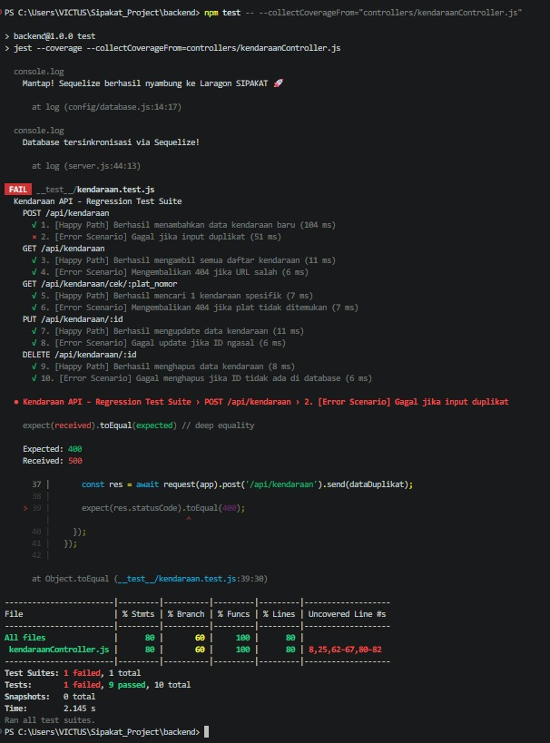
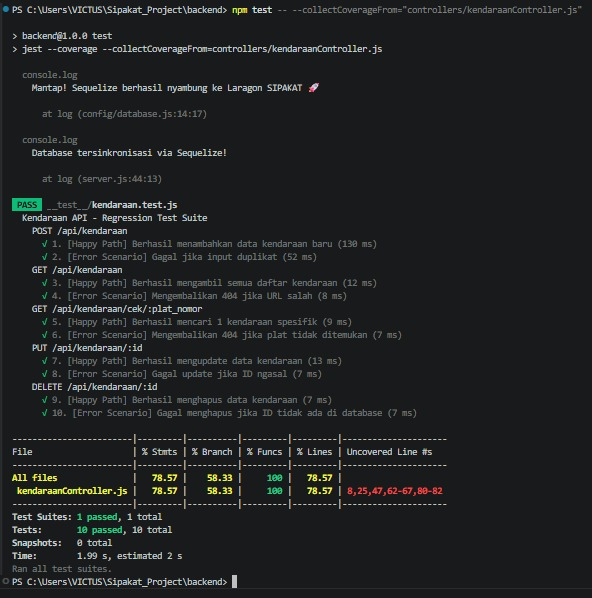

# Regression Test Suite - SIPAKAT (Modul Kendaraan)

Tugas Praktikum Pertemuan 13 - Pengujian dan Penjaminan Kualitas Perangkat Lunak. Dikerjakan oleh Hanbal Nur Iskandar.

## 1. Demonstrasi Regresi (Test Failing)
Berikut adalah bukti saat sistem sengaja diuji dengan melepas logika validasi `SequelizeUniqueConstraintError` (Plat Duplikat). Sistem berhasil mendeteksi error tersebut:

!(test-gagal.png)
*(Logika validasi telah dikembalikan dan diperbaiki setelah pengujian ini).*

## 2. Laporan Code Coverage
**Catatan:** Karena tugas ini bersifat individual, pengumpulan metrik difokuskan secara spesifik menggunakan `--collectCoverageFrom` pada `kendaraanController.js` yang menjadi tanggung jawab saya.

Hasil menunjukkan pengujian berhasil mencapai **78.57%** (telah melampaui batas minimal 75%):

!(coverage-hijau.png)

## Daftar 10 Test Case (Pola Arrange-Act-Assert):
1. [Happy Path] Berhasil menambahkan data kendaraan baru
2. [Error Scenario] Gagal menambahkan jika terjadi duplikasi Plat Nomor
3. [Happy Path] Berhasil mengambil semua daftar kendaraan
4. [Error Scenario] Mengembalikan error 404 jika URL tidak valid
5. [Happy Path] Berhasil mengambil spesifik kendaraan berdasarkan Plat Nomor
6. [Error Scenario] Mengembalikan error 404 jika Plat Nomor tidak ditemukan
7. [Happy Path] Berhasil memperbarui data kendaraan
8. [Error Scenario] Gagal memperbarui data jika ID tidak valid
9. [Happy Path] Berhasil menghapus data kendaraan
10. [Error Scenario] Gagal menghapus jika ID sudah tidak ada di pangkalan data